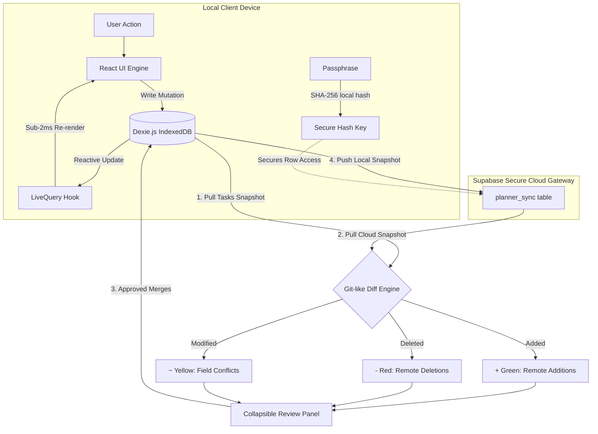

# ✨ Aesthetic Task Planner PWA

[](https://react.dev/)
[](https://vite.dev/)
[](https://www.typescriptlang.org/)
[](https://dexie.org/)
[](https://supabase.com/)
[](https://vite-pwa-org.netlify.app/)

A lightweight, local-first, highly aesthetic glassmorphic task planner built using **React 19**, **TypeScript**, and **Vite**. The application operates under a **local-first paradigm**, offering sub-2ms interface updates and absolute offline independence using browser **IndexedDB (via Dexie.js)**. On-demand cloud synchronization is supported through a secure, passphrase-based **Supabase gateway** featuring a **Git-like interactive merge conflict UI**.

---

## 🏗️ Architecture & Data Flow

Below is the high-fidelity data flow of the application, representing the local database loop, cryptographic hashing, and the cloud synchronization gateway.



---

## 🚀 Key Features

### 1. ⚡ Local-First Speed & Performance
* **Browser-Native IndexedDB**: Powered by **Dexie.js**, your data is stored directly on your physical hardware, enabling storage scales up to hundreds of megabytes.
* **Live Query Binding**: Uses the `useLiveQuery` hook to bind IndexedDB reactivity directly to the React lifecycle. Tapping a task status, shifting columns, or editing text triggers UI updates within **2 milliseconds** with zero network spinners.
* **100% Offline Capable**: The app operates fully offline, seeding clean, realistic, and aesthetic starter tasks automatically on your first boot.

### 2. 🔐 Secure Passphrase Cloud Sync
* **Client-Side Cryptography**: Configuration requires only your private passphrase, which is hashed using **SHA-256** directly inside browser memory. Your raw passphrase is never transmitted over the network or saved in databases.
* **Flexible Backends**: Instantly connect your personal Supabase project by providing your Supabase URL and Anon API key inside the settings panel.

### 3. 🌿 Git-like Visual Diff Engine
* **Detailed Conflict Resolution**: Pulling from the cloud compares the local snapshot against the remote server commit.
* **Interactive Merging Board**: Differences are split into three visual tabs:
  * `added` (`+` Green): New tasks created on another device.
  * `deleted` (`-` Red): Tasks removed on another device.
  * `modified` (`~` Yellow): Specific task fields that conflict (e.g. *Priority: Medium ➔ High*).
* **Granular Approvals**: Tap any modified task to open a side-by-side comparative table showing exact changes. You can selectively **Approve** (accept cloud value) or **Reject** (preserve local value) for each conflict before committing the merge.

### 4. 📱 Premium PWA & Native OS Shortcuts
* **Zero-Network Boots**: Caches all assets dynamically through a registered PWA Service Worker (`vite-plugin-pwa`), speeding up app launches to under 1 second.
* **OS Integrations**: Right-clicking the app on the Windows Taskbar/Start Menu or long-pressing the home screen icon on Android brings up quick actions:
  * ➕ **Create New Task** (URL query `?action=new-task`): Automatically boots the app and slides open the task creation form.
  * 🔄 **Cloud Pull Sync** (URL query `?action=pull`): Automatically launches the app, retrieves your cloud database snapshot, and fires open the Git Diff review modal.

### 5. 💎 Aesthetic Glassmorphic Interface
* Custom modern HSL color tokens for high-contrast dark theme layouts.
* Elegant backdrop-blur cards with smooth transitions and subtle micro-animations.
* Gorgeous visual tags, category indicators, and responsive grid layouts designed perfectly for both phone and desktop displays.

---

## 🛠️ Tech Stack & Dependencies

* **Core**: React 19.2.6, TypeScript 6.0.2, Vite 8.0.12
* **Storage Layer**: Dexie.js 4.4.2, Dexie React Hooks 4.4.0 (IndexedDB wrapper)
* **Cloud Infrastructure**: Supabase JS SDK 2.106.2
* **Styling**: Modern CSS variables & fluid layout engine, Outfit + Inter typography (Google Fonts)
* **Visual Asset Engine**: Lucide React Icons 1.16.0
* **PWA Plugin**: Vite PWA Plugin 1.3.0

---

## 🗄️ Supabase Database Schema

To enable on-demand cloud sync, create the `planner_sync` table in your Supabase project. Navigate to your **Supabase Dashboard** ➔ **SQL Editor**, and run the following script:

```sql
-- 1. Create the sync table
CREATE TABLE IF NOT EXISTS public.planner_sync (
    passphrase_hash TEXT PRIMARY KEY,
    tasks_json JSONB NOT NULL DEFAULT '[]'::jsonb,
    revision INTEGER NOT NULL DEFAULT 1,
    updated_at TIMESTAMP WITH TIME ZONE DEFAULT timezone('utc'::text, now()) NOT NULL
);

-- 2. Enable Row Level Security (RLS)
ALTER TABLE public.planner_sync ENABLE ROW LEVEL SECURITY;

-- 3. Create RLS Policies to allow anonymous public access.
-- Since the passphrase_hash acts as a highly secure, unguessable cryptographic token, 
-- access is secure-by-default using standard SHA-256 signatures.

CREATE POLICY "Allow public read by passphrase hash" 
ON public.planner_sync FOR SELECT USING (true);

CREATE POLICY "Allow public insert by passphrase hash" 
ON public.planner_sync FOR INSERT WITH CHECK (true);

CREATE POLICY "Allow public update by passphrase hash" 
ON public.planner_sync FOR UPDATE USING (true);

CREATE POLICY "Allow public delete by passphrase hash" 
ON public.planner_sync FOR DELETE USING (true);
```

---

## ⚙️ Getting Started

### 📋 Prerequisites
Make sure you have [Node.js](https://nodejs.org/) installed on your machine.

### 📥 Installation

1. **Clone the repository and navigate to the directory**:
   ```bash
   git clone <repository-url>
   cd Task-Planner
   ```

2. **Install all dependencies**:
   ```bash
   npm install
   ```

### 🏃‍♂️ Running Locally

Start the Vite development server:
```bash
npm run dev
```
Open [http://localhost:5173](http://localhost:5173) in your browser to run the app.

### 🏗️ Build & Preview (PWA Verification)

To test the full PWA capabilities, service workers, and caching:

1. **Build the production bundle**:
   ```bash
   npm run build
   ```

2. **Launch the local production preview server**:
   ```bash
   npm run preview
   ```
   Open the provided URL (e.g. `http://localhost:4173`) and click the **Install App** icon in the browser address bar to install it as a standalone desktop/mobile application.

---

## 📂 Folder Structure

```
├── .git/                 # Git Version control
├── public/               # Static assets & icons
│   └── favicon.svg       # Premium maskable PWA icon
├── src/
│   ├── assets/           # UI media assets
│   ├── db.ts             # IndexedDB & Dexie initialization + mock data seeding
│   ├── sync.ts           # SHA-256 hashing, Supabase push/pull & Git-like diff engine
│   ├── types.ts          # Core TypeScript types & data models
│   ├── index.css         # Modern glassmorphic CSS styling framework
│   ├── App.css           # App-specific supplementary styles
│   ├── App.tsx           # Main Application layout & reactive views
│   └── main.tsx          # React client mounter
├── index.html            # Core HTML entrypoint
├── package.json          # Dependency manifest & run scripts
├── tsconfig.json         # TypeScript configuration
├── vite.config.ts        # Vite + VitePWA plugin configurations
└── run_structure.md      # In-depth architectural runtime guide
```

---

## 🏷️ PWA Native OS Shortcuts Deep-Dive

To achieve a true native application feel, the app supports OS level quick actions.

1. **How it Works**: 
   Vite's PWA plugin injects shortcuts into your device’s app launcher. Tapping them navigates to specific routes containing query strings:
   * `Create New Task` ➔ `/?action=new-task`
   * `Cloud Pull Sync` ➔ `/?action=pull`

2. **React Engine Interception**:
   In `src/App.tsx`, a `useEffect` fires on boot, parsing the browser URL:
   ```typescript
   useEffect(() => {
     const params = new URLSearchParams(window.location.search);
     const action = params.get('action');
     
     if (action === 'new-task') {
       setIsCreateModalOpen(true); // Automatically opens task creation form
     } else if (action === 'pull') {
       handleCloudPullFetch();      // Automatically triggers cloud diff pull
     }
   }, []);
   ```
   This architecture provides zero-click navigation actions directly from the operating system's launcher menu!

---

## 📄 License
This project is open-source and available under the [MIT License](LICENSE).
